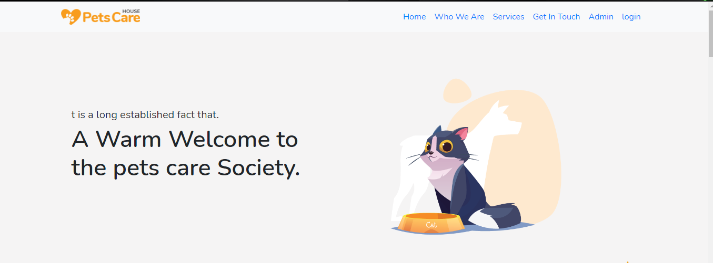
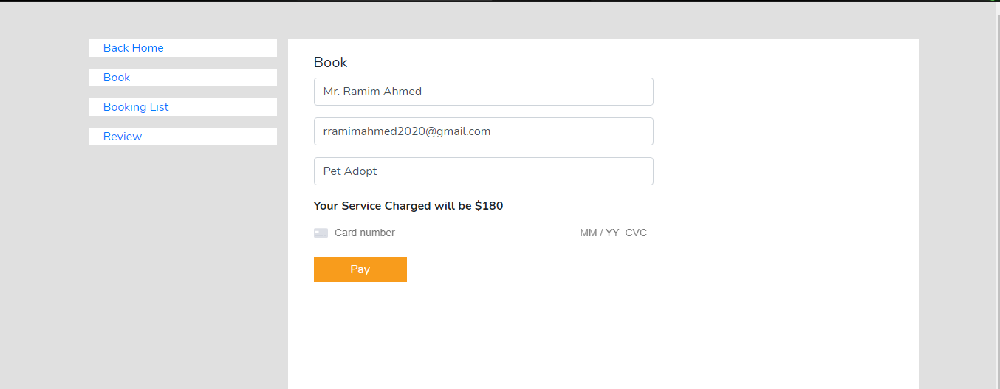
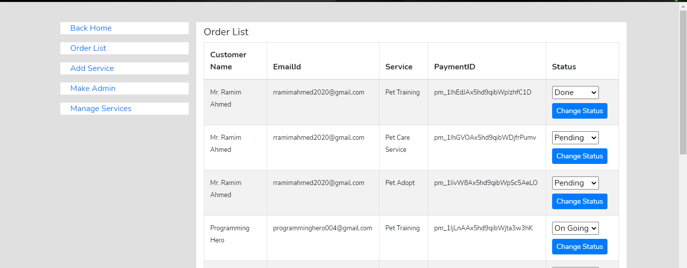

# Pet-Care-House

<h3>Overview</h3>

This is a creative animal Servieces website.

Project Preview : https://pet-care-house-3c798.web.app/ 

  

<h3>Features</h3>
<ul>
  <li>Sign In</li>
  <li>Firebase with User Authentication</li>
  <li>React-Router</li>
  <li>Private Router</li>
  <li>Login with google</li>
  <li>Payment Method</li>
  <li>Stripe Include</li>
  <li>User Admin Panel Implement</li>
  <li>Admin Make Implement</li>
  <li>Dynamically Services Render/Show from DB</li>
  <li>Dynamically Testimonial Render/show from DB</li>
  <li>And so on....</li>
</ul>

<h3> Technology I have used.. </h3>
<ul>
  <li>React JS</li>
  <li>NodeJs</li>
  <li>ExpressJs</li>
  <li>MongoDB</li>
  <li>Firebase<li>
  <li>React Bootstrap</li>
  
</ul>

<h3>Screenshot</h3>
  
   
  
  

  
  
   
  
  

  
  
  
